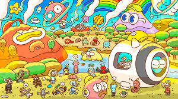

---
title: "3Landers"
description: "以艺术为中心的 10k 社区驱动的 NFT 收藏"
date: 2022-08-01T00:00:00+08:00
lastmod: 2022-08-01T00:00:00+08:00
draft: false
authors: ["crazyxuanshao"]
featuredImage: "3landers.png"
tags: ["Collectibles","3Landers"]
categories: ["nfts"]
nfts: ["Collectibles"]
blockchain: "ETH"
website: "https://3landersnft.com/"
twitter: "https://mobile.twitter.com/3landersnft"
discord: ""
telegram: ""
github: ""
youtube: "https://www.youtube.com/hashtag/3landers"
twitch: ""
facebook: ""
instagram: "https://www.instagram.com/3landersnft_/"
reddit: "https://www.reddit.com/r/3Landers/"
medium: "https://medium.com/@3landers.nft"
steam: ""
gitbook: ""
googleplay: ""
appstore: ""
status: "Live"
weight: 
lightgallery: true
toc: true
pinned: false
recommend: false
recommend1: false
---

3Landers 是一个以社区、冒险和协作为中心的可收藏 NFT 项目。 每个 3Lander 都作为独特的、不可替代的代币 (NFT) 驻留在以太坊区块链上，由特征和底层“DNA”的独特组合组成。 持有 3Landers NFT 让您成为 3Lander - 一个世界和社区的成员，通过合作、冒险、建设、创造和梦想建立有意义的长期联系！

